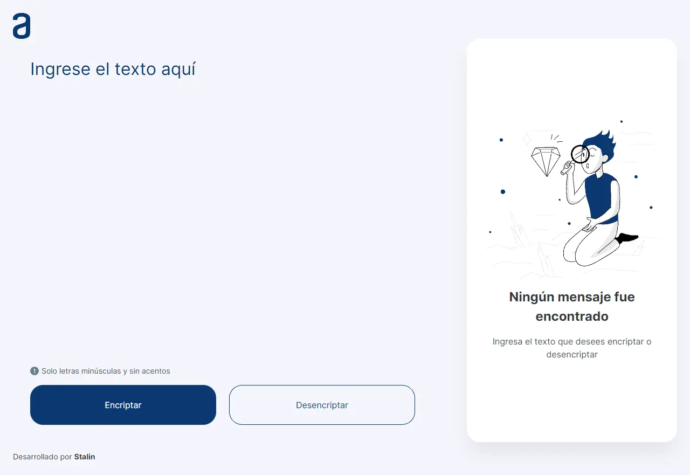

# Encriptador de texto - Alura Challenges ONE

Este es el primer desafío de Alura Challenge ONE, que consiste en construir una aplicación que encripta textos. Así podrás intercambiar mensajes secretos con otras personas que conozcan el método de encriptación utilizado.

## Table of contents

- [Encriptador de texto - Alura Challenges ONE](#encriptador-de-texto---alura-challenges-one)
  - [Table of contents](#table-of-contents)
  - [Resumen](#resumen)
    - [El desafío](#el-desafío)
      - [Requisitos:](#requisitos)
    - [Screenshot](#screenshot)
    - [Enlaces](#enlaces)
    - [Construido con:](#construido-con)
  - [Author](#author)

## Resumen

### El desafío

Las "llaves" de encriptación que utilizaremos son las siguientes:

```
La letra "e" es convertida para "enter"
La letra "i" es convertida para "imes"
La letra "a" es convertida para "ai"
La letra "o" es convertida para "ober"
La letra "u" es convertida para "ufat"
```

#### Requisitos:

- Debe funcionar solo con letras minúsculas
- No deben ser utilizados letras con acentos ni caracteres especiales
- Debe ser posible convertir una palabra para la versión encriptada también devolver una palabra encriptada para su versión original.
- La página debe tener campos para inserción del texto que será encriptado o desencriptado, y el usuario debe poder escoger entre las dos opciones.
- El resultado debe ser mostrado en la pantalla.

Extra

- Un botón que copie el texto encriptado/desencriptado para la sección de transferencia, o sea que tenga la misma funcionalidad del ctrl+C o de la opción "copiar" del menú de las aplicaciones.

Por ejemplo:

```
"gato" => "gaitober"
"gaitober" => "gato"
```

### Screenshot

Versión de escritorio



Versión móvil


### Enlaces

- Solution URL: [GitHub](https://github.com/StalinAM/encriptador_ONE)
- Live Site URL: [Encriptador ONE](https://stalinam.github.io/encriptador_ONE/)

### Construido con:

- Semantic HTML5 markup
- Mobile-first workflow
- CSS custom properties
- Flexbox
- JavaScript
- [Figma](<https://www.figma.com/file/KbGHQjdro8qQAAiqeElCjP/Alura-Challenge---Desaf%C3%ADo-1---L%C3%B3gica-(Copy)?t=JWyVf9qzvGYwG9qj-0>)

## Author

- GitHub - [StalinAM](https://github.com/StalinAM)
- ONE – Oracle Next Education - [Oracle](https://www.oracle.com/lad/education/oracle-next-education/)
- Alura LATAM - [Alura](https://www.aluracursos.com/)
